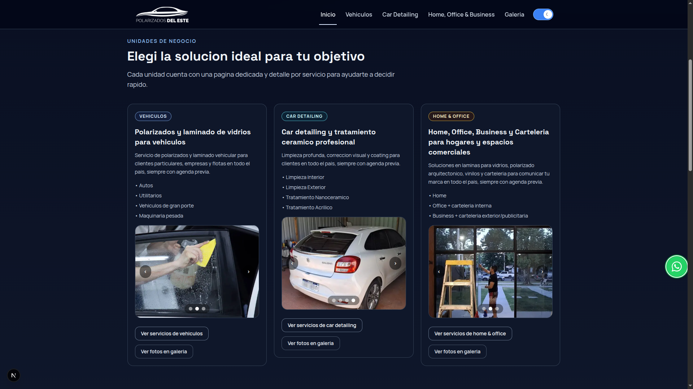

# Polarizados del Este

Modern lead-generation website built for **Polarizados del Este**, focused on converting traffic into real customer inquiries through high-conversion UI, trust signals, and streamlined contact flows.

🚀 Live Demo: www.polarizadosdeleste.com

---

## Preview



---

## About The Project

Polarizados del Este is a commercial marketing website developed for a real services business focused on:

- Window tinting
- Auto detailing
- Home & business solutions

The platform was designed with a strong focus on:

- conversion-oriented UX
- responsive design
- SEO optimization
- fast loading performance
- simplified maintenance
- real inquiry generation

Instead of being just another static landing page, the platform integrates automated review synchronization, interactive galleries, dynamic testimonials, analytics tracking, and validated contact flows to improve trust and maximize conversion.

---

## Tech Stack

- Next.js 16
- React 19
- TypeScript
- Tailwind CSS
- Nodemailer
- Google Places API
- Google Analytics
- Vercel

---

## Features

### SEO & Performance

- SEO-oriented structure
- Semantic HTML
- Optimized metadata
- Responsive design
- Fast loading performance
- Optimized for local business visibility

### Responsive Commercial Landing Page

- Mobile-first design
- Optimized conversion sections
- Modern UI focused on readability and trust

### Lead Capture System

- Contact form with validation
- Simple anti-spam captcha
- SMTP email delivery using Nodemailer

### Analytics & Tracking

- Google Analytics integration
- Traffic and behavior monitoring
- Conversion-oriented tracking

### Google Reviews Sync

- Automated review synchronization script
- Google Places API integration
- Testimonials centralized in `testimonials.ts`

### Interactive Media Gallery

- Carousel navigation
- Modal preview
- Mobile swipe support

### Performance & Deployment

- Production deployment on Vercel
- Lightweight architecture
- No database required
- Low-maintenance structure for real business usage

---

## Problem It Solves

Many small service businesses struggle to transform website visitors into actual customer inquiries.

Polarizados del Este addresses that by combining:

- strong visual trust signals
- real testimonials
- fast contact access
- responsive design
- service-focused conversion structure

The result is a lightweight and maintainable platform optimized for lead generation.

---

## Architecture Notes

- Static-first approach for simplicity and speed
- No authentication layer required
- No database dependency
- Reviews synchronized externally and injected into frontend data structures
- Optimized for easy deployment and maintenance

---

## Local Development

```bash
git clone https://github.com/pablox85/pdewin.git

cd pdewin

npm install

npm run dev
```

Open:

```bash
http://localhost:3000
```

---

## Environment Variables

Create a `.env.local` file:

```env
SMTP_HOST=
SMTP_PORT=
SMTP_USER=
SMTP_PASS=
GOOGLE_PLACES_API_KEY=
```

---

## Deployment

Production deployment hosted on Vercel:

www.polarizadosdeleste.com

---

## Why I Built This

This project was built to create a real-world commercial solution capable of generating leads for a services business while maintaining a lightweight and maintainable architecture.

The focus was not only on UI design, but also on:

- conversion optimization
- maintainability
- responsive experience
- performance
- practical business usability

---

## Author

**Pablo Pérez**

Focused on:

- modern web development
- frontend architecture
- conversion-oriented interfaces
- real-world business solutions

GitHub: https://github.com/pablox85